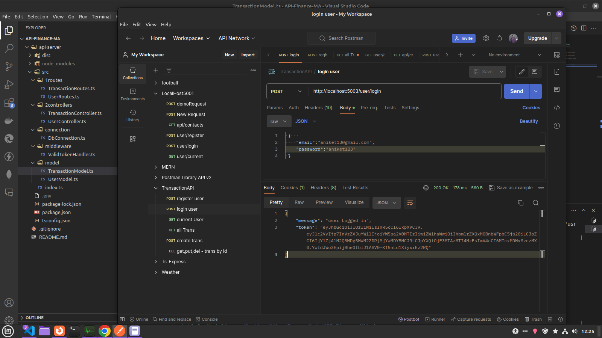
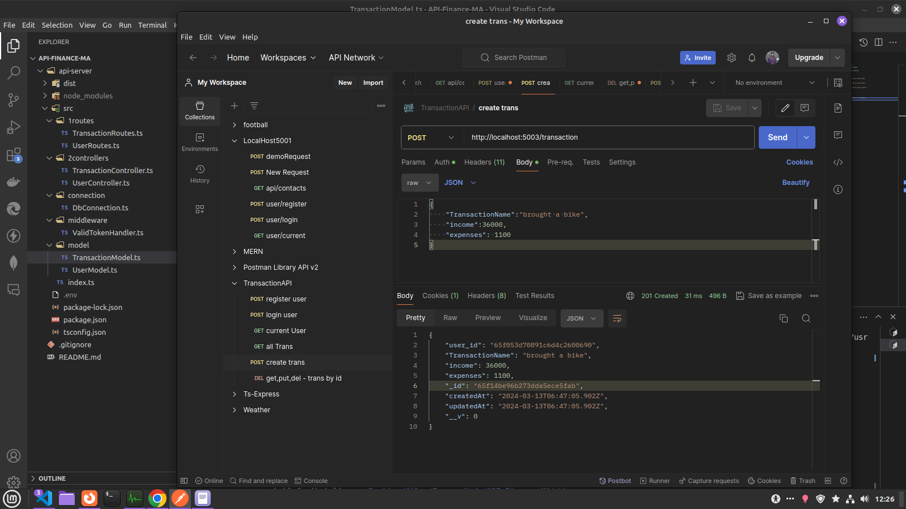

# API-for-a-Personal-Finance-Management-

api- https://api-for-a-personal-finance-management.onrender.com/

"Please note that upon successful login, you will receive a token. This token must be included in the headers of each request using Bearer authentication to verify your authentication. Failure to include the token or using an incorrect or expired token will result in authentication failure."

"Attached are screenshots providing visual guides for reference."

